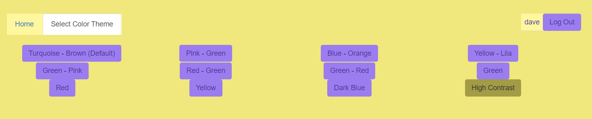
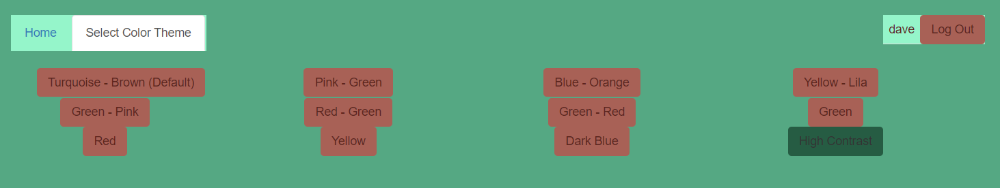

# Medientechnik - MEDT

---

# Stundentafel

| 1.    | 2.    | 3.    |
|-------|-------|-------|
| 2EH   | 2EH   | 2EH   |

--

Allgemeine Folie

--

## Office

* Word
* Excel
* Powerpoint

--

## Webentwicklung

* HTML, CSS
* Javascript / Typescript
* PHP
* REST APIs

---

## HTML & CSS

Mit **HTML** kann die **Struktur** einer Website vorgegeben werden und mit **CSS** kann man anschließend die **Darstellung** der Website anpassen.
Damit Websiten auf verschiedenen Geräten schön zu betrachten sind, wird mit der CSS-Bibliothek **Bootstrap** gearbeitet.

---

## Javascript

**Javascript** ist eine **Programmiersprache** welche dazu verwendet wird **Funktionalität/Logik** zu einer Website hinzuzufügen. 

---

## Javascript - Frameworks
Frameworks sind bereits programmierte Bausteine, welche man verwendet um eigene Anwendungen damit zu erstellen. \
Beispiele, welche im Unterricht behandelt werden:
* Angular
* jQuery

---

## PHP

**PHP** ist eine **Programmiersprache** die sowohl im **Front-** als auch im **Backend** Anwendung findet. \
Unteranderem werden **Schnittstellen** in Verbindung mit **Datenbanken** entworfen und programmiert.

--

## Bild- / Videobearbeitung

* Fotografie
* Farbenlehre
* Adobe Creative Cloud

---

## Fotografie

Es werden Fotos mit einer **4k Kamera** aufgenommen und anschließend mit **Photoshop** und **Lightroom** nachbearbeitet.

---

## Audio

---

## Video

--
CMS SCHAS
